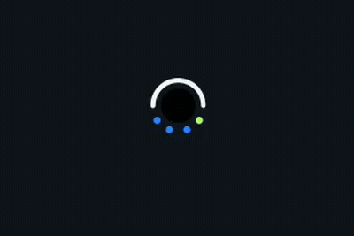
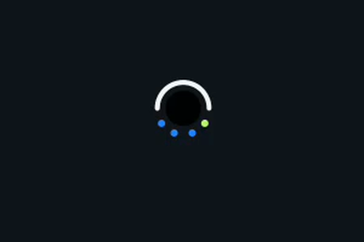

<p align="center">
  <a href="README.md">English</a> | <b>한국어</b>
</p>

# Punch Ring

안드로이드 폰의 **카메라 펀치홀을 배터리·신호 게이지로** 바꾸는 앱입니다.
투명 오버레이가 구멍 둘레에 배터리 호를 그리고 그 아래에 셀룰러·Wi-Fi 점을 겹쳐 놓습니다.
죽은 공간이던 펀치홀이 상태 표시가 됩니다.

<p align="center">
  <br>
  <sub>배터리 호 · 충전 회전 · 상태 방울 · 웃는 얼굴 — 가상 펀치홀로 녹화</sub>
</p>

| 평소 | 카메라 열었을 때 |
|---|---|
|  |  |

**인터넷 권한 없음. 계정 없음. 서버 없음.** 폰이 이미 알고 있는 값만 그립니다.

## 무엇을 보여주나

- **위쪽 호 — 배터리.** 충전 중 연두, 고속충전은 민트색이 천천히 밝기 호흡, 절전 모드 주황,
  15% 미만 빨강.
- **아래쪽 점 — 신호.** 셀룰러가 연두 바탕으로 깔리고, 같은 네 좌표 위를 Wi-Fi 가 더 선명한
  파랑으로 완전히 덮습니다. VPN 을 켜도 하부 실제 Wi-Fi 세기를 읽어 점이 거짓말하지 않습니다.
- **상태 방울.** 충전·완충·블루투스·핫스팟·VPN·네트워크 전환·배터리 고온이 펀치홀에서 방울로
  분리됐다가 잠시 머문 뒤 다시 흡수됩니다.
- **연결 모션.** Wi-Fi·충전·셀룰러가 바뀌면 호가 한 바퀴 돌며 최대 270°까지 늘었다가 실제
  잔량으로 돌아옵니다.

## 조작

- **짧게 누르기** — 셀피 카메라. 구멍 주변의 작은 영역만 터치를 받고, 나머지는 아래 앱으로
  그대로 통과합니다.
- **길게 누르기** — 기기 상태 패널, 또는 **후면 카메라 + 웃는 얼굴**(설정에서 선택).
  카메라를 쓰는 동안 **배터리 호가 제자리에서 180도 돌아 입**이 되고, **신호 점 두 개가 같은 원
  테두리를 타고 올라가 눈**이 됩니다. 화면을 가로로 돌리면 얼굴도 같이 돕니다.

## 컷아웃 호환

안드로이드의 `DisplayCutout` 을 먼저 씁니다. 컷아웃이 여러 개면 크기·원형 비율·화면 가장자리
거리를 기준으로 펀치홀을 고릅니다. 같은 좌표 로직이 폰·태블릿·폴더블과 가로/세로를 모두
처리합니다. 제조사가 컷아웃 정보를 숨기는 기기는 상단 중앙 폴백 + 설정의 수동 미세조정을 쓰고,
폴더블은 커버 화면과 내부 화면의 위치·크기 프로필을 따로 저장합니다.

## 설치

[Releases](../../releases) 에서 APK 를 받아 설치한 뒤:

1. **다른 앱 위에 표시** 허용. 상태 방울을 보려면 알림 권한도.
2. 선택 — **Punch Ring** 접근성 서비스를 켜면 화면 상단 주변 밝기에 따라 링 색이 자동으로
   바뀌고 링 터치가 활성화됩니다. 캡처한 프레임은 메모리에서 바로 버리며 저장·전송하지 않습니다.

안드로이드 12(API 31) 이상.

## 설정

위치·두께, 배터리 호와 신호 점의 지름 분리 조절, 애니메이션 배속(0.1~5배), 스타일 프리셋,
상태 아이콘 크기·머무는 시간·우선순위 편집, 접힘/펼침 화면별 프로필, 레이아웃 가이드,
JSON 설정 백업·복원.

설정 화면 맨 위 미리보기는 **가상 펀치홀**을 그립니다. 그래서 웃는 얼굴을 포함한 모든 연출을
실제 이벤트를 기다리지 않고 버튼으로 바로 시험할 수 있습니다.

## 권한

| 권한 | 이유 |
|---|---|
| `SYSTEM_ALERT_WINDOW` | 다른 앱 위에 링 그리기 |
| `FOREGROUND_SERVICE` | 오버레이 유지 |
| `POST_NOTIFICATIONS` | 오버레이 상주 알림 |
| `READ_PHONE_STATE`, `ACCESS_WIFI_STATE`, `ACCESS_NETWORK_STATE` | 신호 세기 |
| `ACCESS_FINE_LOCATION`, `NEARBY_WIFI_DEVICES` | 안드로이드가 Wi-Fi 세기를 읽을 때 요구 |
| `BLUETOOTH_CONNECT` | 블루투스 연결·해제 이벤트 |
| 접근성 (선택) | 자동 대비 전환·링 터치 |

`INTERNET` 권한이 없어서 기기 밖으로 나가는 값이 없습니다.

## 빌드

Gradle 을 쓰지 않습니다. 빌드 스크립트가 `aapt2` · `javac` · `d8` · `apksigner` 를 직접 부릅니다.

```sh
./scripts/build-android.sh      # → dist/Punch-Ring-Android.apk
```

JDK 17 이상과 `build-tools;36.0.0` · `platforms;android-36` 이 설치된 Android SDK 가 필요합니다.
스크립트는 `ANDROID_HOME` 을 먼저 보고, 없으면 흔한 설치 경로를 찾습니다.

## 라이선스

[MIT](LICENSE). 함께 들어 있는 Pretendard Variable 은 SIL Open Font License 를 따릅니다.
